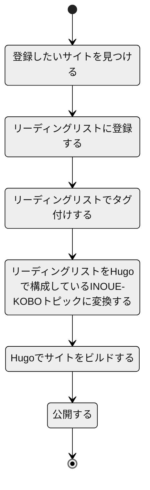
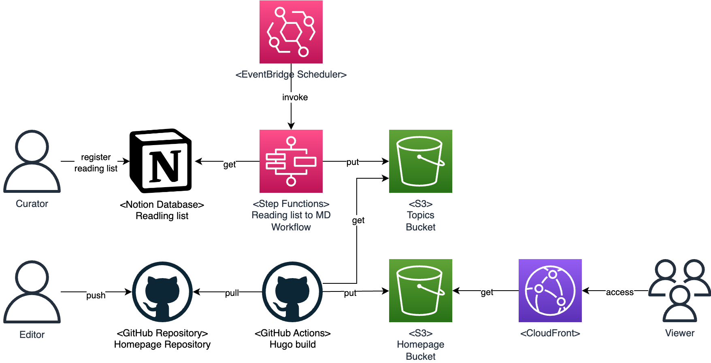

# リーディングリストを Hugo で構成している INOUE-KOBO トピックに変換する(readinglist2inoue-kobo-topics)

Notion データベースで管理しているリーディングリストを Hugo で構成している INOUE-KOBO トピックに変換するスクリプトです。以下の運用を前提としています。



## アーキテクチャ概要



## 開発環境の構築方法

pyvenv を利用して Python 仮想環境を作成することを推奨します。

```bash
python -m venv .venv
```

```bash
. .venv/bin/activate
pip install -r app/readinglist2md/requirements.txt
pip install -r app/readinglist2md/requirements-dev.txt
pip install -r cdk/requirements.txt
pip install -r cdk/requirements-dev.txt
```

## テストの実行方法

プロジェクトのルートフォルダに、`.env` ファイルを作成し、以下の環境変数を設定してください。

```bash
PYTHONPATH=app/readinglist2md
NOTION_API_KEY=changeme
NOTION_DATABASE_ID=changeme
```

その後、pytest を実行してください。

VSCode から pytest を実行する場合は、 `.vscode/settings.json` に以下を設定してください。

```json
{
    "python.testing.pytestArgs": ["-s", "app/tests"],
    "python.testing.unittestEnabled": false,
    "python.testing.pytestEnabled": true
}
```

## デプロイ手順

### 事前に作成するリソース

-   Parameter Store: /readinglist2inoue-kobo-topics/NotionApiKey
-   Parameter Store: /readinglist2inoue-kobo-topics/NotionDatabaseId
-   Parameter Store: /readinglist2inoue-kobo-topics/OutputBucketName

### デプロイ手順

```bash
cd cdk
AWS_DEFAULT_REGION=ap-northeast-1 cdk synth # CFnが意図した通り出力されることを確認します。
AWS_DEFAULT_REGION=ap-northeast-1 cdk diff # 差分を確認します。
AWS_DEFAULT_REGION=ap-northeast-1 cdk deploy
```

## Developers' Note

### Github Actions の設定

```yaml
name: Deploy into www.inoue-kobo.com
on:
    push:
        branches:
            - master
    workflow_dispatch:
    schedule:
        - cron: '0 0 * * 3' # 毎週火曜日の0時(JST 9時)に実行します。

jobs:
    build:
        runs-on: ubuntu-22.04
        steps:
            - name: Checkout
              uses: actions/checkout@v3
              with:
                  submodules: true

            - name: Configure AWS credentials
              uses: aws-actions/configure-aws-credentials@v1
              with:
                  aws-access-key-id: ${{ secrets.AWS_ACCESS_KEY_ID }}
                  aws-secret-access-key: ${{ secrets.AWS_SECRET_ACCESS_KEY }}
                  aws-region: ap-northeast-1

            - name: Download Topic Files from S3
              continue-on-error: true # s3 syncがexit code 2を返すため、エラーを無視します。
              env:
                  AWS_ACCESS_KEY_ID: ${{ secrets.AWS_ACCESS_KEY_ID }}
                  AWS_SECRET_ACCESS_KEY: ${{ secrets.AWS_SECRET_ACCESS_KEY }}
                  HOMEPAGE_S3_BUCKET: ${{ secrets.HOMEPAGE_S3_BUCKET }}
              run: |
                  aws s3 sync s3://$HOMEPAGE_S3_BUCKET/topics ./www/content

            - name: Setup Hugo
              uses: peaceiris/actions-hugo@v2
              with:
                  hugo-version: '0.138.0'
                  extended: true
                  path: /tmp/hugo_cache

            - name: Build Hugo
              working-directory:
              run: |
                  cd www
                  hugo --environment production

            - name: Upload file to S3
              env:
                  AWS_ACCESS_KEY_ID: ${{ secrets.AWS_ACCESS_KEY_ID }}
                  AWS_SECRET_ACCESS_KEY: ${{ secrets.AWS_SECRET_ACCESS_KEY }}
                  HOMEPAGE_S3_BUCKET: ${{ secrets.HOMEPAGE_S3_BUCKET }}
              run: |
                  aws s3 sync www/public s3://$HOMEPAGE_S3_BUCKET/docs-v2 --delete
                  aws cloudfront create-invalidation --region ap-northeast-1 --distribution-id E3JEKHZG9UN3GI --paths "/*"
```
